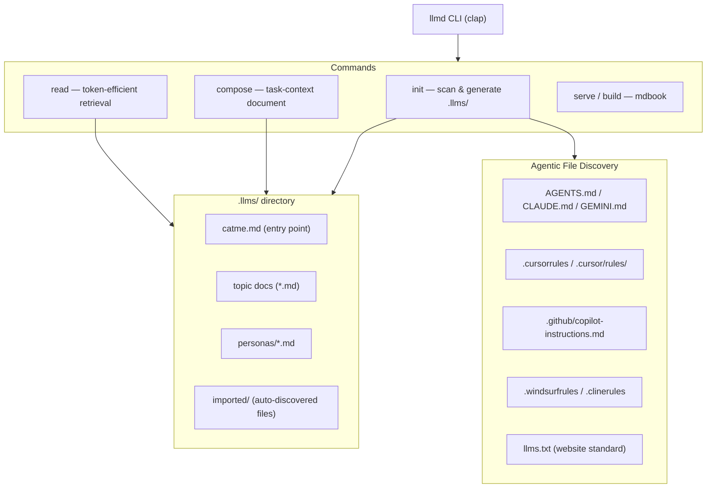

# llmd v1.0.0 CLI — Implementation Plan

## Design Philosophy

The codebase must be **minimal, clean, and immediately readable**. Every module, function, and file must have a single clear purpose that is obvious from its name and location. No clever abstractions, no unnecessary layers, no code that requires study to understand. A developer (or agent) reading the source for the first time should be able to understand the entire codebase in one sitting.

Concretely:

- Each source file does one thing. If a file is doing two things, split it.
- No premature generalisation. Implement exactly what is needed for v1.0.0.
- Prefer straightforward imperative code over trait hierarchies or macro magic.
- Errors are handled with `anyhow` — no custom error type towers.
- CLI output is clean plain text; no unnecessary decoration.
- Dependencies are kept to the minimum viable set. Every crate added must earn its place.

## What We're Building

A Rust CLI (`llmd`) that:

1. **Reads** context from an `.llms/` directory in a token-efficient way for agents.
2. **Initialises** a new `.llms/` directory by scanning the project and discovering existing agent markdown files.
3. **Serves** the `.llms/` directory as a human-browsable mdbook site.
4. **Composes** a contextually-relevant markdown document for a task by combining `catme.md` with on-demand sections.

## Architecture




## Directory Structure

```
.llms/
  catme.md             # Entry point / navigation map
  imported/            # Auto-discovered existing agent files
    AGENTS.md
    CLAUDE.md
    ...
  <topic>.md           # User-authored or generated topic docs
  personas/            # Role-specific context docs
```

## CLI Commands

### `llmd init [--update]`

- Walk the project tree using `ignore` crate (respects `.gitignore`)
- Discover all known agent markdown formats (AGENTS.md, CLAUDE.md, GEMINI.md, AGENT.md, .cursorrules, .cursor/rules/, .github/copilot-instructions.md, .github/instructions/*.instructions.md, .windsurfrules, .clinerules, .builderrules, JULES.md, CONVENTIONS.md, llms.txt, SPEC.md, PRD.md, Plan.md)
- Copy/symlink discovered files into `.llms/imported/`
- Generate `catme.md` with navigation map referencing all found files
- `--update` mode: diff against existing `.llms/` and only regenerate changed sections

### `llmd read <file-or-topic> [--section <heading>] [--grep <regex>] [--lines <start:end>] [--tokens]`

- `llmd read catme` — prints `catme.md`
- `--section "Error Handling"` — AST parse (via `pulldown-cmark`) and extract just that H2/H3 section
- `--grep <pattern>` — ripgrep-style search with configurable context lines
- `--lines 10:50` — windowed read using `BufReader`
- `--tokens` — print estimated token count before content (using `tiktoken-rs` or simple word-count heuristic)

### `llmd compose <task-description> [--include <topic>...] [--output <file>]`

- Accept a task description (string or `--from <file>`)
- Keyword-match the description against section headings and filenames in `.llms/`
- Compose a single markdown document: task header + `catme.md` summary + matched topic sections
- Output to stdout or `--output <file>` (e.g., `Plan.md`, `task-context.md`)

### `llmd serve` / `llmd build`

- Generate an `mdbook`-compatible `book.toml` + `src/` from `.llms/`
- `llmd build` — run `mdbook build` (shells out, requires mdbook installed or bundles it)
- `llmd serve` — run `mdbook serve` with a local dev server

### `llmd search <query>`

- Full-text search across `.llms/` using `grep-searcher`
- Returns matching file, heading, and surrounding lines

## Key Crates

- `clap` — CLI argument parsing with derive macros
- `ignore` — directory traversal respecting .gitignore
- `pulldown-cmark` — Markdown AST parsing for section extraction
- `grep-searcher` + `grep-regex` — SIMD-optimised search
- `serde` + `serde_yaml` — YAML frontmatter parsing
- `walkdir` — simple recursive directory walking for mdbook generation
- `tokio` — async I/O for parallel file reading
- `anyhow` — ergonomic error handling
- `colored` — terminal output formatting

## Issue Tracker (Flat File)

Progress documented in `issues/` directory at project root:

- `issues/README.md` — index of all issues
- `issues/NNNN-<slug>.md` — individual issues with status (`open`/`in-progress`/`done`), description, and notes

## File Layout

```
llmd/
  Cargo.toml
  Cargo.lock
  src/
    main.rs           # clap CLI entrypoint
    commands/
      init.rs
      read.rs
      compose.rs
      serve.rs
      search.rs
    discovery.rs      # agent file discovery logic
    llms_dir.rs       # .llms/ directory management
    markdown.rs       # AST parsing, section extraction
    catme.rs          # catme.md generation
    error.rs
  issues/
    README.md
    0001-initial-cli-scaffold.md
    0002-init-command.md
    ...
  task/               # existing task docs (unchanged)
```

## Implementation Order

1. Scaffold `Cargo.toml` with all dependencies and `src/` module structure
2. Implement `discovery.rs` — find all known agent markdown files
3. Implement `init` command — generate `.llms/` and `catme.md`
4. Implement `read` command — sectional extraction, grep, windowed read, token count
5. Implement `compose` command — keyword-matching and document composition
6. Implement `search` command — full-text grep across `.llms/`
7. Implement `serve`/`build` commands — mdbook integration
8. Set up flat-file issue tracker in `issues/`
9. Write `README.md` for the crate (installation, usage, examples)
10. Bump version to `1.0.0` in `Cargo.toml`

